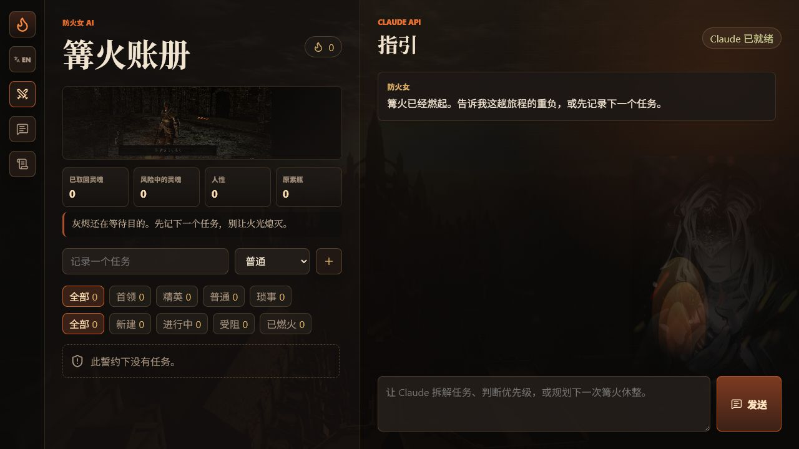

# 本地化

Fire Keeper AI 支持英文和简体中文。文档站点默认显示中文，英文版本位于 `/en/`。

## 当前行为

- 侧栏语言按钮可以在英文和简体中文之间切换。
- 语言选择会保存到 `localStorage`。
- `document.documentElement.lang` 会随语言变化更新。
- `document.title` 会本地化。
- 任务类型、状态、筛选器、tooltip、placeholder 和提示会本地化。
- Claude 请求会携带当前语言。
- Markdown 导出会使用后端支持的当前语言标签。

## 术语表

中文文案应参考《黑暗之魂》官方中文与通行译名，避免英文术语夹杂在中文界面中。

| English | 简体中文 | 用法 |
| --- | --- | --- |
| Fire Keeper | 防火女 | 角色/助手人格 |
| Bonfire | 篝火 | 休息点、任务账册氛围 |
| Covenant | 誓约 | 空状态和组织隐喻 |
| Souls | 灵魂 | 任务奖励/风险计数 |
| Humanity | 人性 | 完成任务计数 |
| Estus Flask | 原素瓶 | 行动压力/恢复隐喻 |
| Boss | 首领 | 大型任务类型 |
| Elite | 精英 | 重要中型任务类型 |
| Regular | 普通 | 日常任务类型 |
| Tedious | 琐事 | 必要杂务类型 |
| Kindled | 已燃火 | 完成状态 |

## 数据层规则

canonical data values 保持英文：

- 任务类型：`boss`、`elite`、`regular`、`tedious`
- 任务状态：`new`、`active`、`blocked`、`kindled`

只本地化展示层、AI prompt、导出文案和文档。不要把中文展示文案写入 canonical storage value。

## 相关文件

- `apps/web/src/i18n.js`
- `apps/web/test/i18n.test.js`
- `apps/api/src/services/i18nService.js`
- `apps/api/src/services/claudeService.js`
- `apps/api/src/services/exportService.js`
