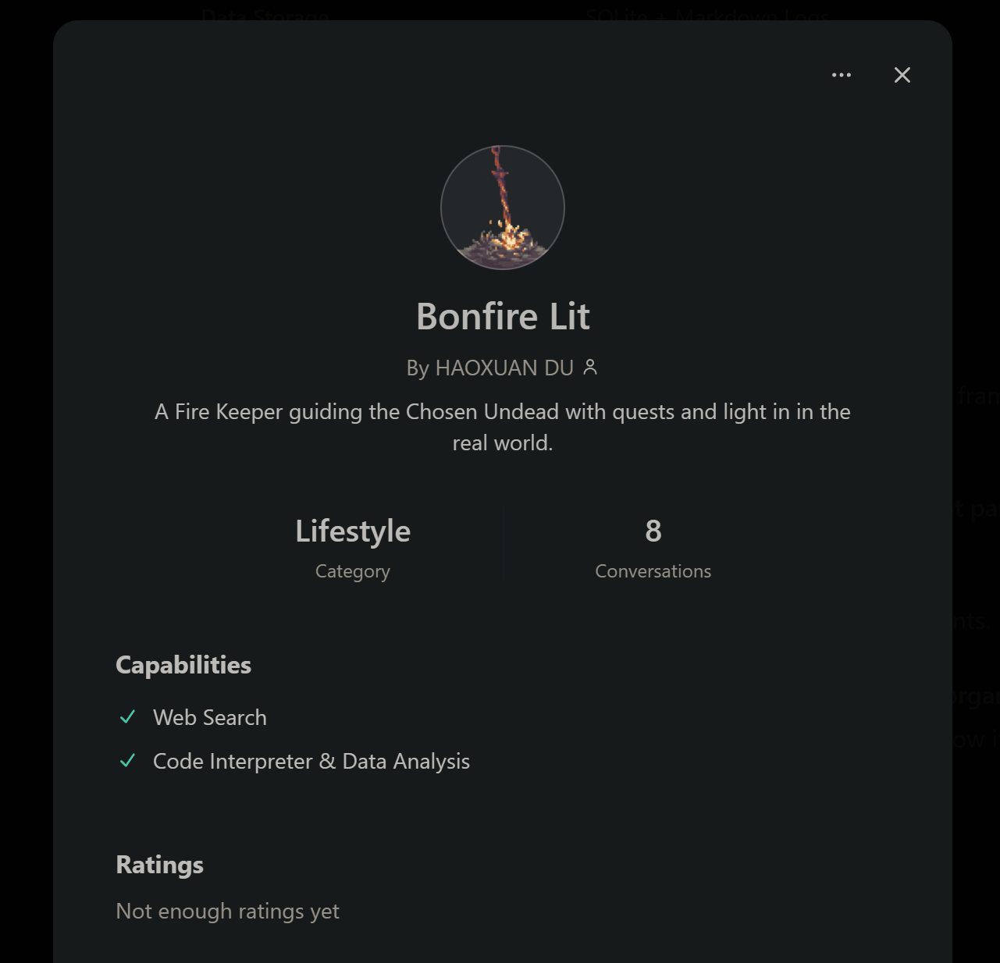

# 🔥 Fire Keeper AI (防火女AI)

Init: 02/01/2025, The project officially initiated...

> May the flames guide thee. A Dark Souls inspired AI assistant for task management and conversation.

## 🎯 Project Overview
Fire Keeper AI is your personal assistant that combines task management with AI conversation capabilities, wrapped in a Dark Souls themed interface. The project aims to create an immersive, practical tool that helps manage your daily tasks while maintaining the atmospheric essence of Dark Souls.


> Soul could be found here: 
>
> **Bonfire Lit** by @Holly Du
> 
> https://chatgpt.com/g/g-6788056bb1b48191aa120623ed0232f3-bonfire-lit
> 
## ⚔️ Core Features

### LLM Integration
- [ ] Research and evaluate existing LLM chat GUIs
- [ ] Implement lightweight testing with AISuite
- [ ] Support multiple LLM backends:
  - OpenAI GPT
  - DeepSeek
  - Claude
  - Local models support

### Frontend Development
- [ ] Design main interface with dual-panel layout:
  - TODO List panel
  - Conversation panel
- [ ] Implement google calendar view with atmospheric background
- [ ] Create Dark Souls inspired animations:
  - Bonfire flame effects
  - Task completion animations
- [ ] Develop task classification system:
  - 💀 Boss (Major tasks)
  - ⚔️ Elite (Medium priority)
  - 👿 Regular (Normal tasks)
  - 💩 Tedious (But necessary)

  - 🔥 Kindled (Completed bonfire that light your way)

### Backend Development
- [ ] Implement local data storage system
- [ ] Develop encryption for secure file I/O
- [ ] Create Markdown export functionality
- [ ] Set up GitHub private repository for data management


### Graphics 
- [ ] Implement atmospheric Dark Souls themed interface
- [ ] Set up image processing pipeline:
  - Sharp for optimization
  - Canvas API for effects
  - WebGL for advanced visuals
- [ ] Create and integrate assets:
  - [ ] Generate themed art with DALL-E 3/Midjourney / Hand made
  - [ ] Design custom SVG icons
  - [ ] Build Dark Souls inspired elements:
    - [ ] Bonfire navigation hub
    - [ ] Weapon icon buttons
    - [ ] Parchment backgrounds
    - [ ] Gothic frame borders

## 🛠️ Tech Stack
- Frontend: TypeScript, React/Svelte, CSS/HTML
- Backend: Python
- Storage: Local SQLite/JSON
- Version Control: Git/GitHub

## 📁 Project Structure
Note: this could be changed a lot. 

```bash
BONFIRE-LIT-AI\
├─config
├─docs
│  ├─api
│  └─design
├─scripts
├─src
│  ├─backend
│  │  ├─api
│  │  ├─models
│  │  └─services
│  ├─frontend
│  │  ├─components
│  │  ├─pages
│  │  ├─styles
│  │  └─utils
│  └─shared
│      ├─constants
│      └─types
└─tests
    ├─integration
    └─unit
```