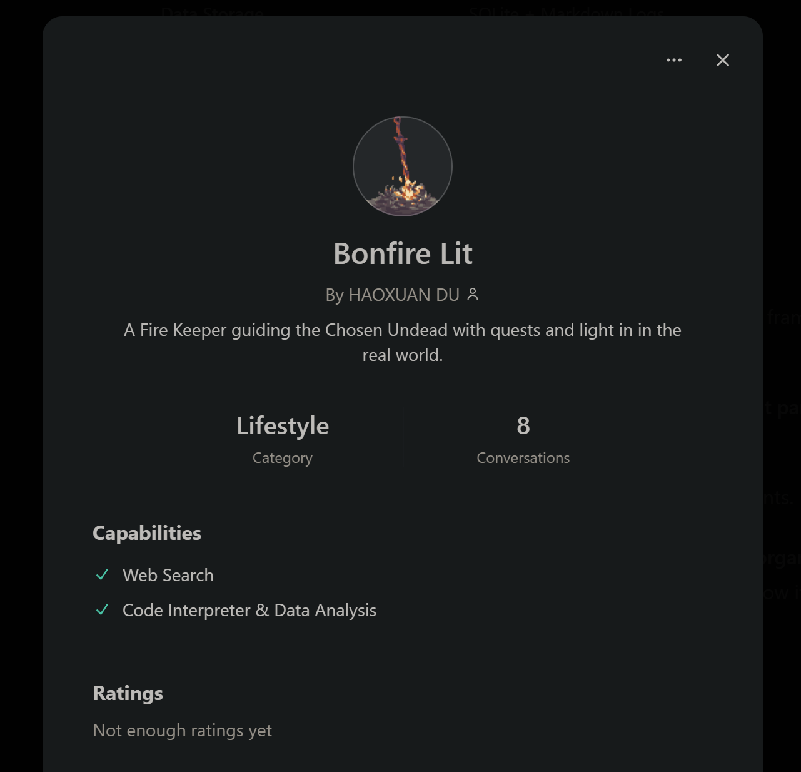

# Fire Keeper AI (防火女 AI)

Fire Keeper AI is a Dark Souls inspired personal task manager with an AI guidance panel. It combines a themed React interface, local task storage, Markdown export, and Claude streaming chat.

> May the flames guide thee.

## Current Features

- Dual-pane web app: task ledger on the left, AI guidance on the right.
- Task classes: Boss, Elite, Regular, Tedious.
- Task statuses: New, Active, Blocked, Kindled.
- Create, edit, delete, filter, and kindle tasks.
- Claude streaming chat with current open tasks included as context.
- Markdown export to `data/exports`.
- One-click English / Chinese switching.
- Local SQLite persistence under `data/firekeeper.sqlite`.

## Language Support

The app supports one-click English and Simplified Chinese switching from the side rail.

- UI labels, placeholders, tooltips, task classes, and statuses switch immediately.
- The selected language is persisted in `localStorage`.
- Claude requests include the active language.
- The backend switches the Claude system prompt with the UI language.
- Open-task context sent to Claude localizes task class and status names.
- Markdown exports use the active language for titles, sections, task classes, and empty states.

Chinese copy follows official Dark Souls style terminology:

- Fire Keeper: 防火女
- Bonfire: 篝火
- Covenant: 誓约

## Tech Stack

- Frontend: React 19, Vite, CSS, lucide-react
- Backend: Express 5, Claude API via `@anthropic-ai/sdk`
- Storage: Node SQLite (`node:sqlite`)
- Runtime data: local `data/` directory

## Project Structure

```text
FireKeeperAI/
├─ apps/
│  ├─ api/
│  │  └─ src/
│  │     ├─ db/
│  │     ├─ routes/
│  │     └─ services/
│  └─ web/
│     ├─ src/
│     │  ├─ api/
│     │  ├─ assets/
│     │  ├─ App.jsx
│     │  ├─ i18n.js
│     │  └─ taskLogic.js
│     └─ test/
├─ data/
├─ docs/
└─ package.json
```

## Setup

```bash
npm install
```

Create a local `.env` file from `.env.example`:

```bash
ANTHROPIC_API_KEY=
CLAUDE_MODEL=claude-sonnet-4-6
PORT=8787
WEB_ORIGIN=http://localhost:5173
```

## Development

```bash
npm run dev
```

The default URLs are:

- Web: `http://localhost:5173`
- API: `http://localhost:8787`

On Windows PowerShell, if script execution policy blocks `npm`, use `npm.cmd`:

```bash
npm.cmd run dev
```

## Verification

```bash
npm.cmd test
npm.cmd run build
```

Current test coverage includes task filtering/counting logic, language fallback/formatting, and localized Claude task context.

## Original Soul

**Bonfire Lit** by Holly Du  
https://chatgpt.com/g/g-6788056bb1b48191aa120623ed0232f3-bonfire-lit


